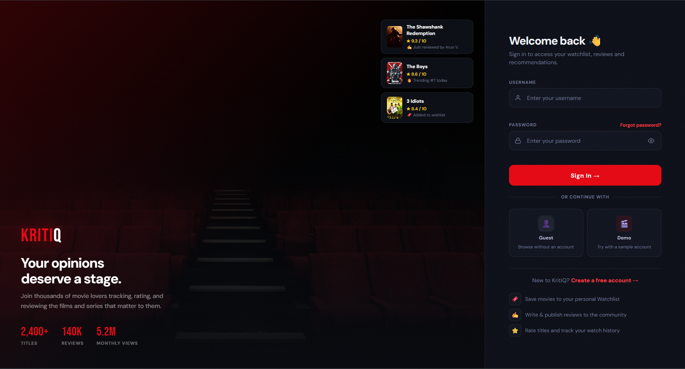

# KritiQ — Movies & Series Review Website

KritiQ is a modern movie and series review website built using **HTML5**, **CSS3**, and **vanilla JavaScript**.  
It provides a cinematic browsing experience for movies and series through a polished dark interface, red-accent branding, title cards, ratings, detail pages, wishlist-style interactions, and authentication screens.

The project is designed as a front-end entertainment platform inspired by modern streaming and review websites.

---

## Live Preview

> Add your GitHub Pages link here after deployment.

```text
https://aditya099pat.github.io/KritiQ/
```

---

## Project Overview

KritiQ allows users to explore popular movies and series through a visually rich interface.  
The website includes a homepage with featured titles, top-ranked content, trending sections, box-office sections, dedicated title landing pages, and sign-in/register pages.

The main focus of this project is:

- Clean UI design
- Cinematic visual presentation
- Consistent red, black, and white branding
- Smooth page structure
- Organized movie and series information
- Front-end development using HTML, CSS, and JavaScript

---

# Website Screenshots

The screenshots below are arranged in order so the README feels like a top-to-bottom walkthrough of the website.

---

## Homepage Walkthrough

### 1. Homepage Hero Section


The homepage begins with a cinematic hero section featuring the KritiQ logo, navigation bar, search bar, featured title, rating, genre tags, and call-to-action buttons.

---

### 2. Stats and Top 10 Section


This section displays platform statistics, category filters, and the Top 10 titles of the day in a horizontal card-based layout.

---

### 3. Trending and Box Office Sections


The homepage continues with curated content sections such as Trending in India and Top Box Office India, showing popular titles with posters, ratings, years, and categories.

---

### 4. Homepage Footer


The footer contains the KritiQ brand description, discovery links, genre links, account links, copyright details, and a clean closing layout.

---

## Title Landing Page Walkthrough

### 1. Landing Page Hero Section


The title detail page opens with a large cinematic banner, poster, title, ratings, tags, and user action buttons such as wishlist, like, dislike, and share.

---

### 2. Trailer, Ratings, and Show Information


This section includes a trailer preview area, rating cards, rating distribution, show information, genre tags, and streaming availability.

---

### 3. Storyline, Cast, and Reviews Section


The detail page continues with a storyline section, cast cards, community review input, and supporting show information.

---

### 4. Community Reviews and Footer


The page ends with community reviews, user feedback cards, footer spacing, copyright text, and a navigation link back to the homepage.

---

## Authentication Pages

### Sign In Page



The sign-in page follows the same dark cinematic design and includes username/password fields, guest/demo options, account navigation, and supporting feature highlights.

---

### Register Page


The register page provides a clean account creation form with username, email, password, and confirm password fields in a centered card layout.

---

## Features

- Cinematic homepage with featured hero section
- Dark professional UI with red accent branding
- Movie and series cards with rankings and ratings
- Top 10, trending, and box-office sections
- Individual title landing/detail pages
- IMDb-style and Rotten Tomatoes-style rating cards
- Storyline, cast, reviews, and show information sections
- Sign-in page
- Create account page
- Search bar UI
- Wishlist, like, dislike, and share-style buttons
- Custom KritiQ favicon
- Responsive layout styling
- Built using simple front-end technologies

---

## Pages Included

The project includes the following pages:

- `index.html`
- `the boys.html`
- `avatar.html`
- `dune.html`
- `spiderman.html`
- `godfather.html`
- `shawshank.html`
- `game of thrones.html`
- `the family man.html`
- `3 idiots.html`
- `agneepath.html`
- `ghajini.html`
- `kabirsingh.html`
- `kho gaye hum kahan.html`
- `escape.html`
- `login page.html`
- `create_acc.html`

---

## Tech Stack

- HTML5
- CSS3
- Vanilla JavaScript
- SVG favicon

---

## Project Structure

```text
KritiQ/
│
├── assets/
│   └── favicon.svg
│
├── screenshots/
│   ├── Homepage1.png
│   ├── Homepage2.png
│   ├── Homepage3.png
│   ├── Homepage4.png
│   ├── Landing1.png
│   ├── Landing2.png
│   ├── Landing3.png
│   ├── Landing4.png
│   ├── Sign In.png
│   └── Register.png
│
├── index.html
├── styles.css
├── login page.html
├── create_acc.html
├── avatar.html
├── dune.html
├── game of thrones.html
├── the boys.html
├── escape.html
├── spiderman.html
├── godfather.html
├── shawshank.html
├── agneepath.html
├── 3 idiots.html
├── ghajini.html
├── kabirsingh.html
├── kho gaye hum kahan.html
├── the family man.html
└── README.md
```

---

## How to Run Locally

### 1. Clone the repository

```bash
git clone https://github.com/Aditya099pat/KritiQ.git
```

### 2. Open the project folder

```bash
cd KritiQ
```

### 3. Run the website

Open `index.html` directly in your browser.

For a better development experience, open the project in VS Code and run it using the **Live Server** extension.

---

## Screenshots Setup

Create a folder named `screenshots` in the project root and save your screenshots with these exact names:

```text
screenshots/Homepage1.png
screenshots/Homepage2.png
screenshots/Homepage3.png
screenshots/Homepage4.png
screenshots/Landing1.png
screenshots/Landing2.png
screenshots/Landing3.png
screenshots/Landing4.png
screenshots/Sign In.png
screenshots/Register.png
```

The screenshots will automatically appear in this README after the files are pushed to GitHub.

---

## Deployment with GitHub Pages

To deploy the project using GitHub Pages:

1. Open the GitHub repository.
2. Go to **Settings**.
3. Open **Pages** from the sidebar.
4. Under **Build and deployment**, select **Deploy from a branch**.
5. Choose:
   - Branch: `main`
   - Folder: `/root`
6. Click **Save**.

GitHub will generate a live website URL after a short delay.

---

## Future Improvements

- Add working search functionality
- Add interactive carousel controls
- Add working wishlist storage
- Add user review submission logic
- Improve mobile responsiveness
- Add genre, year, and rating filters
- Connect the website to a movie database API
- Add page transitions and animations
- Add backend authentication in the future

---

## Author

**Aditya Patil**

GitHub: [Aditya099pat](https://github.com/Aditya099pat)

---

## License

This project is created for learning, portfolio, and educational purposes.