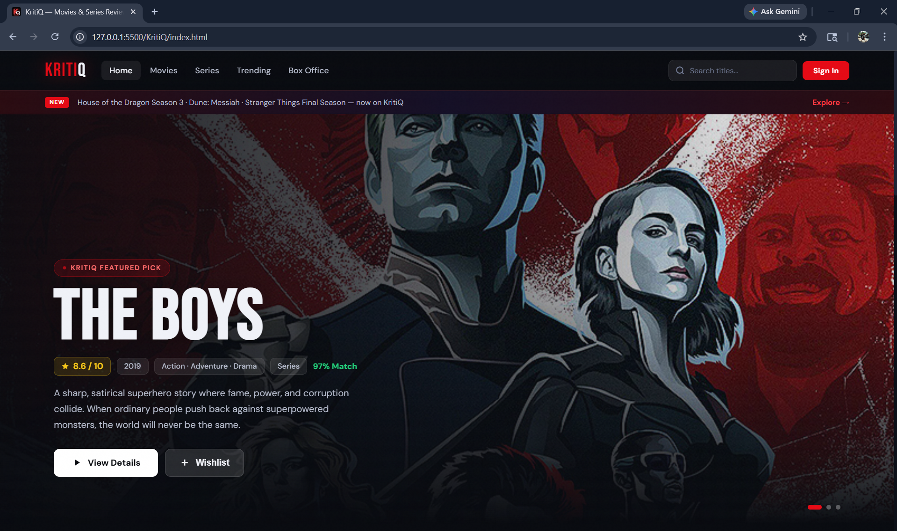
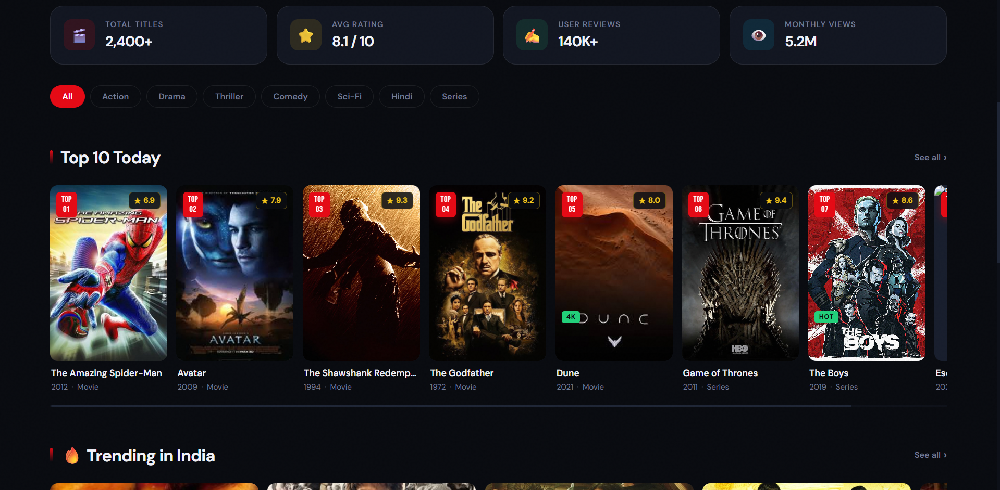
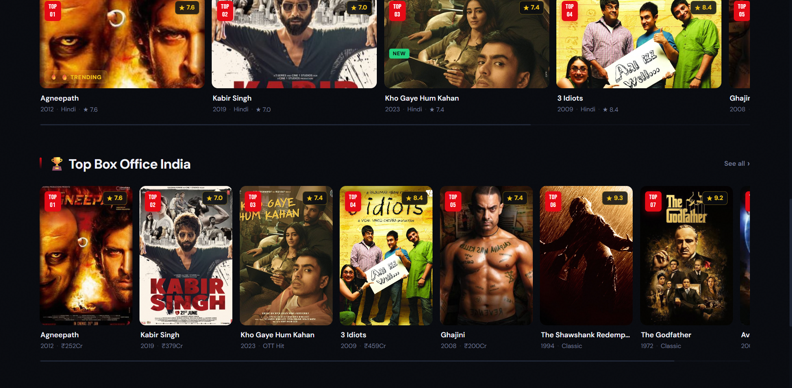
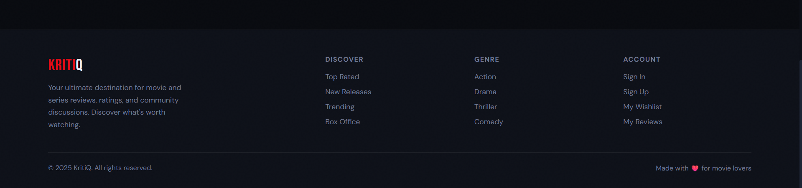
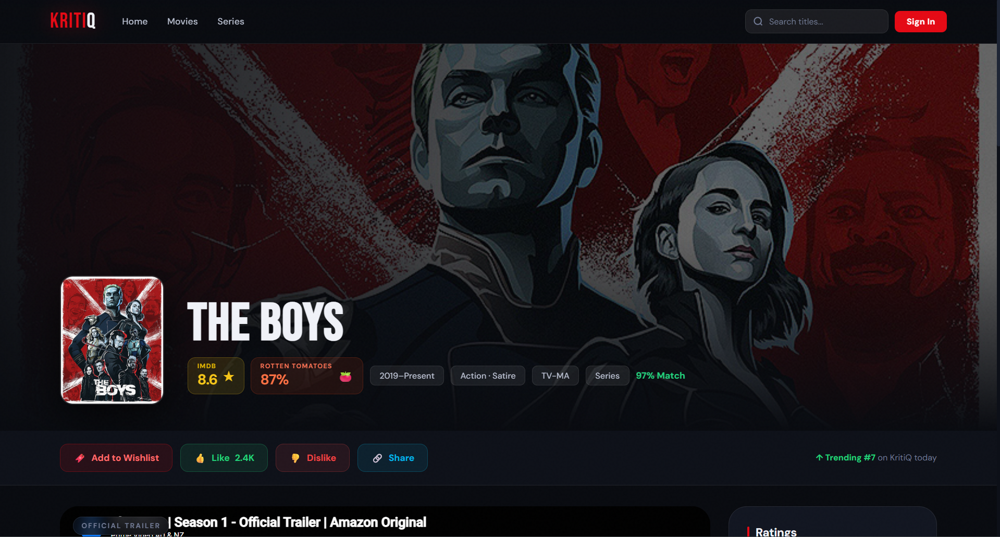
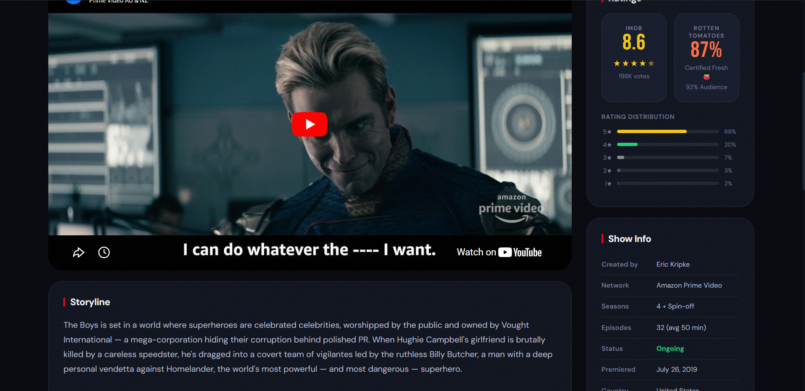
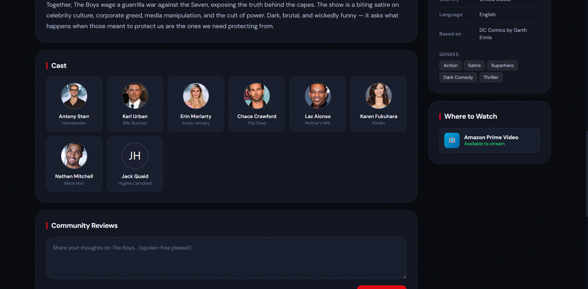
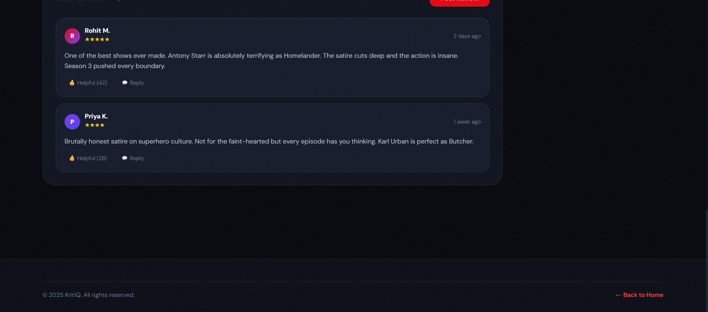
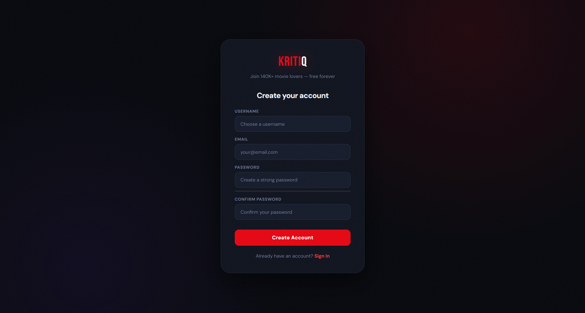

# KritiQ — Movies & Series Review Website

KritiQ is a modern movie and series review website built using **HTML5**, **CSS3**, and **vanilla JavaScript**.  
It provides a cinematic browsing experience for movies and series through a polished dark interface, red-accent branding, title cards, ratings, detail pages, wishlist-style interactions, and authentication screens.

The project is designed as a front-end entertainment platform inspired by modern streaming and review websites.

---

## Live Preview

> Add your GitHub Pages link here after deployment.

```text
https://aditya099pat.github.io/KritiQ/
```

---

## Project Overview

KritiQ allows users to explore popular movies and series through a visually rich interface.  
The website includes a homepage with featured titles, top-ranked content, trending sections, box-office sections, dedicated title landing pages, and sign-in/register pages.

The main focus of this project is:

- Clean UI design
- Cinematic visual presentation
- Consistent red, black, and white branding
- Smooth page structure
- Organized movie and series information
- Front-end development using HTML, CSS, and JavaScript

---

# Website Screenshots

## Homepage Walkthrough





---

## Title Landing Page Walkthrough





## Sign In Page


## Register Page



---

## Features

- Cinematic homepage with featured hero section
- Dark professional UI with red accent branding
- Movie and series cards with rankings and ratings
- Top 10, trending, and box-office sections
- Individual title landing/detail pages
- IMDb-style and Rotten Tomatoes-style rating cards
- Storyline, cast, reviews, and show information sections
- Sign-in page
- Create account page
- Search bar UI
- Wishlist, like, dislike, and share-style buttons
- Custom KritiQ favicon
- Responsive layout styling
- Built using simple front-end technologies

---

## Tech Stack

- HTML5
- CSS3
- Vanilla JavaScript

---

## Project Structure

```text
KritiQ/
│
├── assets/
│   └── favicon.svg
│
├── screenshots/
│   ├── Homepage1.png
│   ├── Homepage2.png
│   ├── Homepage3.png
│   ├── Homepage4.png
│   ├── Landing1.png
│   ├── Landing2.png
│   ├── Landing3.png
│   ├── Landing4.png
│   ├── Sign In.png
│   └── Register.png
│
├── index.html
├── styles.css
├── login page.html
├── create_acc.html
├── avatar.html
├── dune.html
├── game of thrones.html
├── the boys.html
├── escape.html
├── spiderman.html
├── godfather.html
├── shawshank.html
├── agneepath.html
├── 3 idiots.html
├── ghajini.html
├── kabirsingh.html
├── kho gaye hum kahan.html
├── the family man.html
└── README.md
```

---

## How to Run Locally

### 1. Clone the repository

```bash
git clone https://github.com/Aditya099pat/KritiQ.git
```

### 2. Open the project folder

```bash
cd KritiQ
```

### 3. Run the website

Open `index.html` directly in your browser.

For a better development experience, open the project in VS Code and run it using the **Live Server** extension.

---